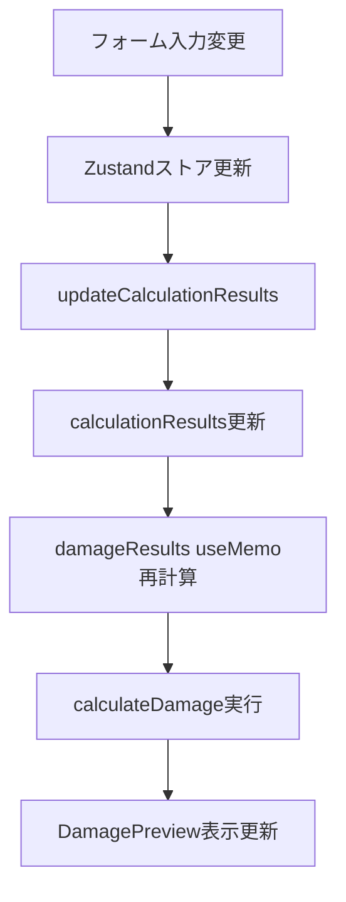
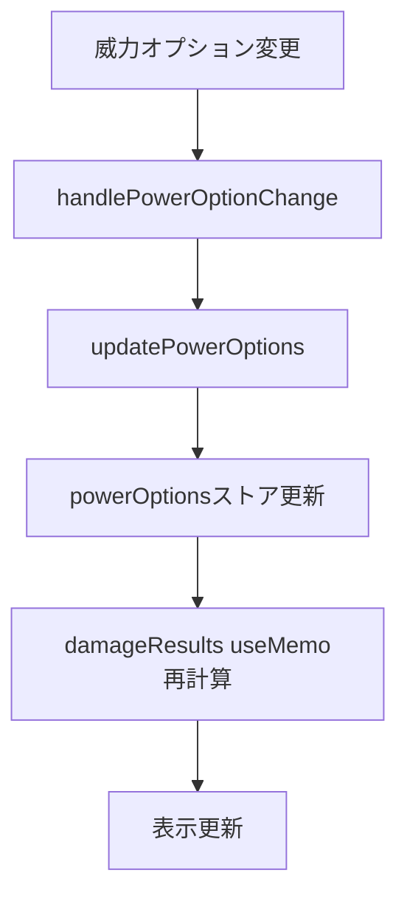
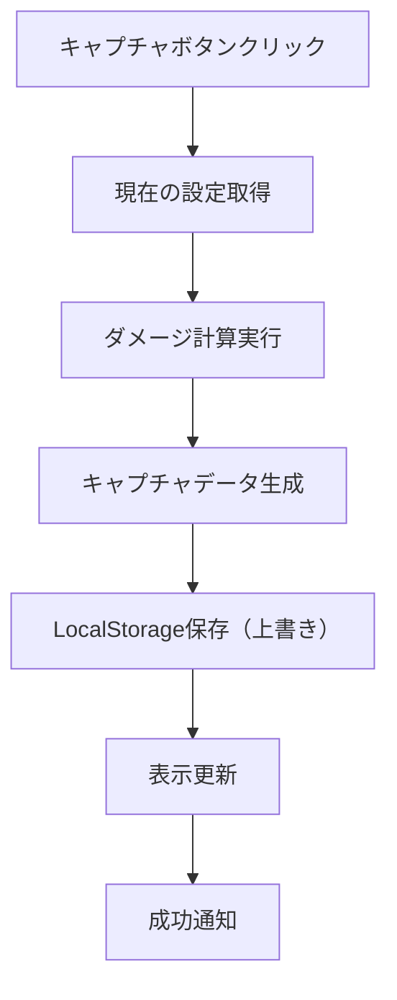

# DamagePreview 実装ドキュメント

## 概要

DamagePreviewコンポーネントは、Toram Onlineダメージ計算機の表示専用コンポーネントとして、計算されたダメージ値・安定率・威力オプション設定を表示するコンポーネントです。

**目的**: フォーム入力に基づいてリアルタイムでダメージ計算結果を表示し、詳細な威力オプション設定を提供する（表示のみ、入力はしない）

**主要機能**:
- ダメージ値と安定率のリアルタイム表示（最小・最大・平均）
- 8つの威力オプション設定（ボス難易度、スキルダメージ、属性攻撃など）
- ダメージデータのキャプチャ機能（過去1回分のみ保存）
- キャプチャしたダメージとの比較表示
- LocalStorageによるキャプチャデータの永続化（全セーブデータ共通）
- 中央集約されたダメージ計算エンジンとの統合

## 実装されたレイアウト構造

### 全体構造
```
┌─────────────────────────────────────────────────────────────────┐
│ DamagePreview (青背景)                                          │
├─────────────────────────────────────────────────────────────────┤
│ ダメージ表示テーブル                                             │
│ ┌─────────┬─────────────────┬─────────────────┐                 │
│ │項目     │ 現在の計算結果   │ [キャプチャ]ボタン │                 │
│ │         ├─────────┬───────┼─────────┬───────┤                 │
│ │         │ダメージ │安定率  │ダメージ │安定率  │                 │
│ ├─────────┼─────────┼───────┼─────────┼───────┤                 │
│ │最小     │50,000   │90%    │52,000   │90%    │                 │
│ │最大     │60,000   │100%   │60,000   │100%   │                 │
│ │平均     │56,000   │95%    │57,000   │95%    │                 │
│ └─────────┴─────────┴───────┴─────────┴───────┘                 │
├─────────────────────────────────────────────────────────────────┤
│ 慣れ倍率（スライダー実装済み）                                     │
├─────────────────────────────────────────────────────────────────┤
│ 敵：[選択された敵の名前]                                           │
│ ※ラフィー選択時は属性覚醒注意書き表示                             │
├─────────────────────────────────────────────────────────────────┤
│ 威力オプション                                                   │
│ ┌─────────────────┬─────────────────┐                         │
│ │ ボス戦難易度     │ Normal/Hard/... │                         │
│ │ スキルダメージ   │ 全て/1撃目/...  │                         │
│ │ 属性攻撃        │ 有(有利)/無/... │                         │
│ │ コンボ:強打     │ 有効/無効       │                         │
│ │ ダメージ判定     │ 白ダメ/Critical │                         │
│ │ 距離判定        │ 近距離/遠距離   │                         │
│ │ 属性威力        │ 有効/有利のみ   │                         │
│ │ 抜刀威力        │ 有効/無効       │                         │
│ └─────────────────┴─────────────────┘                         │
└─────────────────────────────────────────────────────────────────┘
```

### レスポンシブ対応
- **デスクトップ**: 左右2カラム表示
- **タブレット**: 左右2カラム表示（幅調整）
- **モバイル**: 上下積み重ね表示

## 実装されたコンポーネント構造

### ファイル構成
```
src/components/layout/
└── DamagePreview.tsx              # 単一ファイルで完結した実装

src/utils/
├── damageCalculation.ts           # メインダメージ計算エンジン
├── damageCaptureStorage.ts        # キャプチャデータ管理
├── bossDifficultyCalculation.ts   # ボス難易度計算
└── attackSkillCalculation.ts      # スキル計算

src/stores/
└── calculatorStore.ts             # Zustand状態管理
```

### 実装アーキテクチャ
- **単一コンポーネント**: 分離されたサブコンポーネントは使用せず、一つのファイルで完結
- **Zustand統合**: 中央集約された状態管理との密接な統合
- **計算エンジン統合**: damageCalculationService.tsと同じ計算ロジックを使用

## 実装されたデータ仕様

### ダメージ計算結果
```typescript
// ダメージ表示結果の型定義
interface DamageDisplayResult {
	min: number
	max: number
	average: number
	stability: number
	averageStability: number
}

// ダメージ計算結果の型定義
interface DamageResults {
	normal: DamageDisplayResult
	skill: DamageDisplayResult
}

// 威力オプション（実装済み）
interface PowerOptions {
  bossDifficulty: 'normal' | 'hard' | 'lunatic' | 'ultimate'
  skillDamage: 'all' | 'hit1' | 'hit2' | 'hit3'
  elementAttack: 'advantageous' | 'other' | 'none' | 'disadvantageous'
  combo: boolean
  damageType: 'critical' | 'graze' | 'expected' | 'white'
  distance: 'short' | 'long' | 'disabled'
  elementPower: 'enabled' | 'advantageOnly' | 'awakeningOnly' | 'disabled'
  unsheathe: boolean
}
```

### キャプチャデータ
```typescript
interface DamageCaptureData {
  damageResult: DamageCalculationResult // ダメージ計算結果
  capturedAt: string                   // キャプチャ時刻（内部管理用）
}

// LocalStorageキー（全セーブデータ共通）
const DAMAGE_CAPTURE_KEY = 'damageCaptureData'
```

## UI仕様詳細

### ダメージ表示テーブル
- **列構成**: 項目 | ダメージ | 安定率
- **フォーマット**: ダメージは3桁区切り、安定率は%表示
- **色分け**: 最大値は緑、最小値は赤、平均値は青

### キャプチャボタン
- **位置**: 画面右上
- **スタイル**: プライマリボタン
- **アイコン**: カメラアイコン
- **状態**: 通常・ホバー・無効化

### キャプチャデータ表示
- **ダメージ値**: 最小・最大・平均ダメージ
- **安定率**: 各ダメージに対応する安定率
- **比較表示**: 現在の計算結果との差分

## アニメーション・UX仕様

### リアルタイム更新
- **更新頻度**: フォーム入力変更時（デバウンス300ms）
- **アニメーション**: 数値変更時のフェードイン効果
- **ローディング**: 計算中のスピナー表示

### キャプチャ機能
- **成功フィードバック**: 成功トースト通知
- **エラーハンドリング**: エラートースト通知
- **確認ダイアログ**: 既存データがある場合の上書き確認

## レスポンシブ設計

### ブレークポイント
- **デスクトップ**: 1024px以上
- **タブレット**: 768px - 1023px
- **モバイル**: 767px以下

### レイアウト変更
```typescript
const LAYOUT_CONFIG = {
  desktop: {
    columns: 2,
    gap: '2rem',
    capturePanel: 'right'
  },
  tablet: {
    columns: 2,
    gap: '1.5rem',
    capturePanel: 'right'
  },
  mobile: {
    columns: 1,
    gap: '1rem',
    capturePanel: 'bottom'
  }
}
```

## 実装されたデータフロー

### 計算結果の取得


### 威力オプション管理


### キャプチャフロー


## テーマ・スタイリング

### カラーパレット
```css
:root {
  --damage-min-color: #ef4444;      /* 最小ダメージ（赤） */
  --damage-max-color: #22c55e;      /* 最大ダメージ（緑） */
  --damage-avg-color: #3b82f6;      /* 平均ダメージ（青） */
  --table-border: #e5e7eb;          /* テーブル境界線 */
  --table-header: #f9fafb;          /* テーブルヘッダー背景 */
  --capture-button: #6366f1;        /* キャプチャボタン */
}
```

### タイポグラフィ
- **ダメージ値**: font-size: 1.125rem, font-weight: 600
- **安定率**: font-size: 1rem, font-weight: 500
- **項目名**: font-size: 0.875rem, font-weight: 500

## アクセシビリティ

### キーボード操作
- **Tab**: フォーカス移動
- **Enter/Space**: ボタン実行
- **Escape**: モーダル閉じる

### スクリーンリーダー対応
- **aria-label**: ボタンとテーブルに説明追加
- **role**: テーブル構造の明示
- **aria-live**: 計算結果更新の通知

## パフォーマンス最適化

### メモ化戦略
```typescript
// 計算結果のメモ化
const damageResult = useMemo(() => {
  return calculateDamage(calculatorData)
}, [calculatorData])

// キャプチャデータのメモ化
const captureData = useMemo(() => {
  return getCaptureData()
}, [captureDataVersion])
```

### 更新頻度制御
- **デバウンス**: 300ms
- **バッチ更新**: React 18のautomatic batching活用

## エラーハンドリング

### 計算エラー
- **ゼロ除算**: 安全な初期値設定
- **オーバーフロー**: 最大値制限
- **不正入力**: バリデーション

### ストレージエラー
- **容量不足**: キャプチャデータの削除確認
- **権限エラー**: フォールバック処理
- **破損データ**: データ修復・初期化

## LocalStorage設計

### ストレージ仕様
```typescript
// LocalStorageキー（全セーブデータ共通）
const DAMAGE_CAPTURE_KEY = 'damageCaptureData'

// ストレージ操作関数
export const saveCaptureData = (data: DamageCaptureData): void => {
  localStorage.setItem(DAMAGE_CAPTURE_KEY, JSON.stringify(data))
}

export const loadCaptureData = (): DamageCaptureData | null => {
  const stored = localStorage.getItem(DAMAGE_CAPTURE_KEY)
  return stored ? JSON.parse(stored) : null
}

export const clearCaptureData = (): void => {
  localStorage.removeItem(DAMAGE_CAPTURE_KEY)
}
```

### データ共有仕様
- **スコープ**: 全セーブデータ共通（ユーザー全体で1つ）
- **保存件数**: 1件のみ（最新のキャプチャで上書き）
- **データ利用**: どのセーブデータからでもアクセス可能
- **保存内容**: ダメージ値と安定率のみ（シンプルな比較用データ）

## 実装された威力オプション機能

### 8つの威力オプション（実装完了）

1. **ボス戦難易度**: Normal/Hard/Lunatic/Ultimate
2. **スキルダメージ**: 全て/1撃目/2撃目/3撃目  
3. **属性攻撃**: 有(有利)/有(その他)/無/不利属性
4. **コンボ:強打**: 有効/無効
5. **ダメージ判定**: Critical/Graze/白ダメ/期待値
6. **距離判定**: 近距離/遠距離/無効化
7. **属性威力**: 有効/有利のみ/覚醒のみ/無効
8. **抜刀威力**: 有効/無効

### セーブデータ統合（実装済み）
威力オプションはセーブデータの一部として保存され、セーブデータ切り替え時に自動的に復元されます。

```typescript
// calculatorStoreでの管理
const powerOptions = useCalculatorStore((state) => state.data.powerOptions)
const updatePowerOptions = useCalculatorStore((state) => state.updatePowerOptions)
```

## ダメージ計算統合

### 中央集約された計算エンジン
DamagePreviewは中央集約された計算システムと統合されています：

```typescript
// 中央集約された計算結果を使用
const totalATK = calculationResults?.basicStats.totalATK || 0
const stabilityRate = calculationResults?.basicStats.stabilityRate || 85

// 貫通値の取得
const penetration = {
	physical: calculationResults?.equipmentBonus1?.physicalPenetration ?? defaultInput.penetration.physical,
	magical: calculationResults?.equipmentBonus1?.magicalPenetration ?? defaultInput.penetration.magical,
}
```

### ダメージ計算の詳細ログ
実装では詳細なデバッグログが出力され、計算過程を確認できます：

```typescript
console.log('=== DAMAGE CALCULATION DEBUG ===')
console.log('1. レベル情報:', input.playerLevel, input.enemyLevel)
console.log('2. 参照ステータス:', input.referenceStat)
console.log('3. 敵の防御力:', input.enemy.DEF, input.enemy.MDEF)
console.log('4. 貫通値:', input.penetration)
console.log('5. 属性有利:', input.elementAdvantage.total)
```

## UIコンポーネント詳細

### 威力オプションUI実装
すべての威力オプションはボタン形式で実装され、選択状態に応じて背景色が変化します：

```typescript
// ボタンスタイル例
className={`px-3 py-1 text-xs md:text-[13px] rounded cursor-pointer ${
	powerOptions.bossDifficulty === difficulty
		? 'bg-blue-400 text-white'
		: 'bg-gray-100 text-gray-700 hover:bg-gray-200'
}`}
```

### レスポンシブ対応
- **モバイル**: `text-xs` (10px)
- **デスクトップ**: `md:text-[13px]` (13px)
- **ギャップ調整**: `sm:gap-2` (768px以上で適用)

## キャプチャ機能実装

### キャプチャボタン
テーブルヘッダー内にカメラアイコン付きのボタンとして実装：

```typescript
<button
	onClick={handleCapture}
	className="px-3 py-1 bg-blue-500 text-white rounded-md hover:bg-blue-600"
>
	<svg className="w-3 h-3" /* カメラアイコン */ />
	キャプチャ
</button>
```

### キャプチャデータ管理
```typescript
const handleCapture = () => {
	const currentDamage = damageResults.normal
	const newCaptureData = createCaptureData(
		currentDamage.min,
		currentDamage.max,
		currentDamage.average,
		currentDamage.stability,
		currentDamage.averageStability,
	)
	saveCaptureData(newCaptureData)
	setCaptureData(newCaptureData)
}
```

## パフォーマンス最適化

### useMemo使用
ダメージ計算は重い処理のため、useMemoで最適化：

```typescript
const damageResults = useMemo((): DamageResults => {
	// 複雑なダメージ計算ロジック
	return calculateDamageWithAllOptions()
}, [calculatorData, calculationResults, powerOptions])
```

### 条件付きレンダリング
```typescript
if (!isVisible) {
	return null
}

if (!powerOptions) {
	return <div className="text-center py-4">Loading...</div>
}
```

## エラーハンドリング

### 計算エラーのフォールバック
```typescript
try {
	// 複雑なダメージ計算
	return calculateDamageResults()
} catch (error) {
	console.error('ダメージ計算エラー:', error)
	// エラー時はフォールバック値を返す
	return {
		normal: {
			min: 1000, max: 1500, average: 1250,
			stability: 85, averageStability: 92
		}
	}
}
```

### キャプチャエラー処理
```typescript
try {
	saveCaptureData(newCaptureData)
	console.log('ダメージをキャプチャしました')
} catch (error) {
	console.error('キャプチャに失敗しました:', error)
	alert('キャプチャに失敗しました')
}
```

## 特殊な実装詳細

### 敵情報の動的取得
```typescript
const getSelectedEnemyName = (): string => {
	if (calculatorData.enemy?.selectedEnemyId) {
		const enemy = getPresetEnemyById(calculatorData.enemy.selectedEnemyId)
		if (enemy) {
			return enemy.name
		}
	}
	return '未選択'
}
```

### ラフィー特殊処理
ラフィー選択時は属性覚醒+25%が無効化され、注意書きが表示されます：

```typescript
{/* ラフィー選択時の注意書き */}
{calculatorData.enemy?.selectedEnemyId === '2b981c85-54f5-4c67-bac1-0e9cba4bdeb2' && (
	<p className="text-xs text-orange-600 mt-1">
		※この敵は属性覚醒の有利+25%が適用されません。
	</p>
)}
```

ダメージ計算ロジック内でも同様の判定が行われ、属性覚醒分が計算から除外されます。

### ボス難易度調整
```typescript
// ボス系敵かつ難易度がnormal以外の場合、難易度調整を適用
if (enemyInfo?.category === 'boss' && powerOptions.bossDifficulty !== 'normal') {
	const adjustedStats = calculateBossDifficultyStats(
		finalEnemyLevel,
		enemyInfo.stats,
		powerOptions.bossDifficulty,
	)
	finalEnemyLevel = adjustedStats.level
	finalEnemyDEF = adjustedStats.stats.DEF
	finalEnemyMDEF = adjustedStats.stats.MDEF
}
```

### 攻撃スキル対応
実装では攻撃スキル選択時に自動的にスキル計算を実行：

```typescript
if (calculatorData.attackSkill?.selectedSkillId) {
	const selectedSkill = getAttackSkillById(calculatorData.attackSkill.selectedSkillId)
	if (selectedSkill) {
		const skillCalculationResult = attackSkillCalculation.calculateSkill(
			selectedSkill.id,
			calculatorData,
		)
		// スキルダメージオプションに応じて計算対象の撃を決定
		const getTargetHits = () => {
			switch (powerOptions.skillDamage) {
				case 'hit1': return skillCalculationResult.hits.filter(hit => hit.hitNumber === 1)
				case 'all': return skillCalculationResult.hits
				// ...
			}
		}
	}
}
```

### 慣れ倍率（実装済み）
慣れ倍率は50%-250%の範囲でスライダーと数値入力で調整可能です：

```typescript
// 慣れ倍率スライダーの実装
<div className="flex items-center gap-2 sm:gap-4">
	<div className="flex items-center gap-2">
		<label className="text-[13px] font-semibold text-gray-700">
			慣れ倍率
		</label>
		<div className="text-[13px] font-semibold text-gray-700 min-w-12 text-center">
			{adaptationMultiplier}%
		</div>
	</div>
	<div className="flex-1">
		<input
			type="range"
			min="50"
			max="250"
			value={adaptationMultiplier}
			onChange={(e) => updateAdaptationMultiplier(Number(e.target.value))}
			className="w-full h-2 bg-gray-200 rounded-lg appearance-none cursor-pointer slider-thumb"
		/>
	</div>
	// 数値入力フィールドも実装済み
</div>
```

## 技術的特徴

### Zustand統合
- 威力オプションはcalculatorStoreで一元管理
- セーブデータの一部として自動保存・復元
- リアルタイム更新によるダメージ計算の即座反映

### 計算エンジン統合
- DamagePreview.tsxとdamageCalculationService.tsで同じ計算ロジック使用
- 中央集約されたcalculationResultsからの値取得
- 詳細なデバッグログによる計算過程の透明性

### レスポンシブデザイン
- モバイル・デスクトップ対応のテキストサイズ
- テーブルの横スクロール対応
- ボタンレイアウトのブレークポイント調整

## 更新履歴

| 日付 | 更新内容 | 備考 |
|------|----------|------|
| 2024-12-25 | DamagePreview UI設計書作成 | 初版作成 |
| 2025-01-04 | 威力オプション永続化機能の設計追加 | セーブデータ統合方式で実装 |
| 2025-01-06 | 実装ドキュメントへ更新 | 実際の実装に合わせて全面改訂 |
| 2025-08-01 | 表示専用コンポーネントとして更新 | 慣れ倍率実装・ラフィー特殊処理追加 |

## 関連ドキュメント
- [ダメージ計算ロジック設計書](../calculations/damage-calculation.md) - ダメージ計算の詳細仕様
- [StatusPreview UI設計書](./status-preview.md) - 関連UIコンポーネント
- [基本ステータス計算式](../calculations/basic-stats.md) - 計算基盤
- [クリスタルダメージ差分プレビュー](./crystal-damage-preview.md) - DamagePreviewと統合された差分計算機能

## 実装ファイル
- `src/components/layout/DamagePreview.tsx` - メイン実装ファイル
- `src/utils/damageCalculationService.ts` - 共通ダメージ計算サービス
- `src/utils/damageCaptureStorage.ts` - キャプチャデータ管理
- `src/stores/calculatorStore.ts` - 状態管理