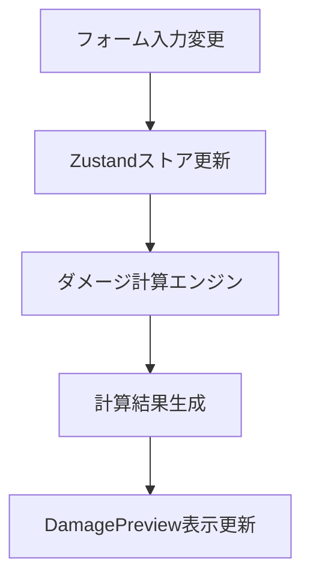
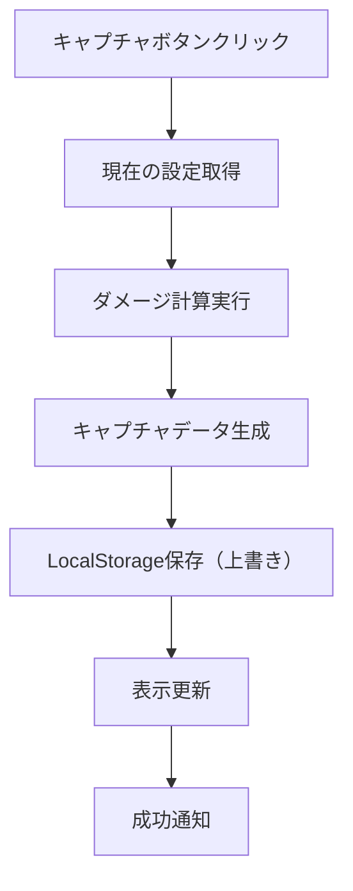

# DamagePreview UI設計書

## 概要

DamagePreviewコンポーネントは、計算されたダメージ値と安定率を表示し、ダメージデータのキャプチャ・記録機能を提供するコンポーネントです。

**目的**: フォーム入力に基づいてリアルタイムでダメージ計算結果を表示し、異なる設定でのダメージ比較を可能にする

**主要機能**:
- ダメージ値と安定率のリアルタイム表示
- 最小・最大・平均ダメージの計算表示
- ダメージデータのキャプチャ機能（過去1回分のみ保存）
- キャプチャしたダメージとの比較表示
- LocalStorageによるキャプチャデータの永続化（全セーブデータ共通）

## レイアウト設計

### 全体構造
```
┌─────────────────────────────────────────────────────────────────┐
│ DamagePreview                                [キャプチャ] ボタン │
└─────────────────────────────────────────────────────────────────┘
┌─────────────────────────────┬───────────────────────────────────┐
│ 現在の計算結果                │ キャプチャしたダメージ             │
│                            │                                  │
│ ┌─────────┬─────────────────┐ │ ┌─────────────┬─────────────────┐ │
│ │項目     │ダメージ │安定率  │ │ │項目         │ダメージ │安定率  │ │
│ ├─────────┼─────────┼───────┤ │ ├─────────────┼─────────┼───────┤ │
│ │最小     │50,000   │90%    │ │ │最小         │52,000   │90%    │ │
│ │最大     │60,000   │100%   │ │ │最大         │60,000   │100%   │ │
│ │平均     │56,000   │95%    │ │ │平均         │57,000   │95%    │ │
│ └─────────┴─────────┴───────┘ │ └─────────────┴─────────┴───────┘ │
│                            │                                  │
│                            │ ※キャプチャデータがない場合は     │
│                            │   「データなし」を表示            │
└─────────────────────────────┴───────────────────────────────────┘
```

### レスポンシブ対応
- **デスクトップ**: 左右2カラム表示
- **タブレット**: 左右2カラム表示（幅調整）
- **モバイル**: 上下積み重ね表示

## コンポーネント構造

### ファイル構成
```
src/components/damage-preview/
├── DamagePreview.tsx              # メインコンポーネント
├── DamageCalculationDisplay.tsx   # 現在の計算結果表示
├── DamageCaptureDisplay.tsx       # キャプチャダメージ表示
└── DamageCaptureButton.tsx        # キャプチャボタンコンポーネント
```

## 表示データ仕様

### ダメージ計算結果
```typescript
interface DamageCalculationResult {
  minimum: {
    damage: number      // 最小ダメージ
    stability: number   // 最小時の安定率(%)
  }
  maximum: {
    damage: number      // 最大ダメージ  
    stability: number   // 最大時の安定率(%)
  }
  average: {
    damage: number      // 平均ダメージ
    stability: number   // 平均安定率(%)
  }
  calculatedAt: string  // 計算時刻
}
```

### キャプチャデータ
```typescript
interface DamageCaptureData {
  damageResult: DamageCalculationResult // ダメージ計算結果
  capturedAt: string                   // キャプチャ時刻（内部管理用）
}

// LocalStorageキー（全セーブデータ共通）
const DAMAGE_CAPTURE_KEY = 'damageCaptureData'
```

## UI仕様詳細

### ダメージ表示テーブル
- **列構成**: 項目 | ダメージ | 安定率
- **フォーマット**: ダメージは3桁区切り、安定率は%表示
- **色分け**: 最大値は緑、最小値は赤、平均値は青

### キャプチャボタン
- **位置**: 画面右上
- **スタイル**: プライマリボタン
- **アイコン**: カメラアイコン
- **状態**: 通常・ホバー・無効化

### キャプチャデータ表示
- **ダメージ値**: 最小・最大・平均ダメージ
- **安定率**: 各ダメージに対応する安定率
- **比較表示**: 現在の計算結果との差分

## アニメーション・UX仕様

### リアルタイム更新
- **更新頻度**: フォーム入力変更時（デバウンス300ms）
- **アニメーション**: 数値変更時のフェードイン効果
- **ローディング**: 計算中のスピナー表示

### キャプチャ機能
- **成功フィードバック**: 成功トースト通知
- **エラーハンドリング**: エラートースト通知
- **確認ダイアログ**: 既存データがある場合の上書き確認

## レスポンシブ設計

### ブレークポイント
- **デスクトップ**: 1024px以上
- **タブレット**: 768px - 1023px
- **モバイル**: 767px以下

### レイアウト変更
```typescript
const LAYOUT_CONFIG = {
  desktop: {
    columns: 2,
    gap: '2rem',
    capturePanel: 'right'
  },
  tablet: {
    columns: 2,
    gap: '1.5rem',
    capturePanel: 'right'
  },
  mobile: {
    columns: 1,
    gap: '1rem',
    capturePanel: 'bottom'
  }
}
```

## データフロー

### 計算結果の取得


### キャプチャフロー


## テーマ・スタイリング

### カラーパレット
```css
:root {
  --damage-min-color: #ef4444;      /* 最小ダメージ（赤） */
  --damage-max-color: #22c55e;      /* 最大ダメージ（緑） */
  --damage-avg-color: #3b82f6;      /* 平均ダメージ（青） */
  --table-border: #e5e7eb;          /* テーブル境界線 */
  --table-header: #f9fafb;          /* テーブルヘッダー背景 */
  --capture-button: #6366f1;        /* キャプチャボタン */
}
```

### タイポグラフィ
- **ダメージ値**: font-size: 1.125rem, font-weight: 600
- **安定率**: font-size: 1rem, font-weight: 500
- **項目名**: font-size: 0.875rem, font-weight: 500

## アクセシビリティ

### キーボード操作
- **Tab**: フォーカス移動
- **Enter/Space**: ボタン実行
- **Escape**: モーダル閉じる

### スクリーンリーダー対応
- **aria-label**: ボタンとテーブルに説明追加
- **role**: テーブル構造の明示
- **aria-live**: 計算結果更新の通知

## パフォーマンス最適化

### メモ化戦略
```typescript
// 計算結果のメモ化
const damageResult = useMemo(() => {
  return calculateDamage(calculatorData)
}, [calculatorData])

// キャプチャデータのメモ化
const captureData = useMemo(() => {
  return getCaptureData()
}, [captureDataVersion])
```

### 更新頻度制御
- **デバウンス**: 300ms
- **バッチ更新**: React 18のautomatic batching活用

## エラーハンドリング

### 計算エラー
- **ゼロ除算**: 安全な初期値設定
- **オーバーフロー**: 最大値制限
- **不正入力**: バリデーション

### ストレージエラー
- **容量不足**: キャプチャデータの削除確認
- **権限エラー**: フォールバック処理
- **破損データ**: データ修復・初期化

## LocalStorage設計

### ストレージ仕様
```typescript
// LocalStorageキー（全セーブデータ共通）
const DAMAGE_CAPTURE_KEY = 'damageCaptureData'

// ストレージ操作関数
export const saveCaptureData = (data: DamageCaptureData): void => {
  localStorage.setItem(DAMAGE_CAPTURE_KEY, JSON.stringify(data))
}

export const loadCaptureData = (): DamageCaptureData | null => {
  const stored = localStorage.getItem(DAMAGE_CAPTURE_KEY)
  return stored ? JSON.parse(stored) : null
}

export const clearCaptureData = (): void => {
  localStorage.removeItem(DAMAGE_CAPTURE_KEY)
}
```

### データ共有仕様
- **スコープ**: 全セーブデータ共通（ユーザー全体で1つ）
- **保存件数**: 1件のみ（最新のキャプチャで上書き）
- **データ利用**: どのセーブデータからでもアクセス可能
- **保存内容**: ダメージ値と安定率のみ（シンプルな比較用データ）

## 威力オプション設定の永続化

### 概要
ダメージプレビューの威力オプション設定をセーブデータ毎にローカルストレージに保存し、セーブデータ切り替え時にも設定を維持する機能を実装します。

### 保存対象の威力オプション
```typescript
interface PowerOptions {
  bossDifficulty: 'normal' | 'hard' | 'lunatic' | 'ultimate'  // ボス戦難易度
  skillDamage: 'all' | 'hit1' | 'hit2' | 'hit3'              // スキルダメージ
  elementAttack: 'advantageous' | 'other' | 'none' | 'disadvantageous'  // 属性攻撃
  combo: boolean                                              // コンボ:強打
  damageType: 'critical' | 'graze' | 'expected' | 'white'    // ダメージ判定
  distance: 'short' | 'long' | 'disabled'                    // 距離判定
  elementPower: 'enabled' | 'advantageOnly' | 'awakeningOnly' | 'disabled'  // 属性威力
  unsheathe: boolean                                          // 抜刀威力
}
```

### 保存仕様

#### セーブデータ統合方式
威力オプションは各セーブデータに含めて保存し、セーブデータ切り替え時に連動して設定も切り替わります。

```typescript
interface SaveData {
  id: string
  name: string
  isDefault: boolean
  createdAt: string
  updatedAt: string
  order: number
  data: {
    // 既存のフォームデータ
    baseStats: BaseStatsFormData
    weapons: WeaponFormData
    crystals: CrystalFormData
    equipments: EquipmentFormData
    food: FoodFormData
    enemy: EnemyFormData
    buffSkills: BuffSkillFormData
    buffItems: BuffItemFormData
    // 新規追加: 威力オプション設定
    powerOptions: PowerOptions
  }
}
```

#### デフォルト値
```typescript
const DEFAULT_POWER_OPTIONS: PowerOptions = {
  bossDifficulty: 'normal',
  skillDamage: 'all',
  elementAttack: 'advantageous',
  combo: false,
  damageType: 'white',
  distance: 'disabled',
  elementPower: 'enabled',
  unsheathe: false
}
```

### 保存タイミング

#### 自動保存
威力オプションの変更時に、現在のセーブデータに自動的に保存されます。

#### 手動保存（「現在のデータを保存」ボタン）
セーブデータ管理画面の「現在のデータを保存」ボタンを押すと、フォームデータと威力オプション設定の両方が保存されます。

### 実装アーキテクチャ

#### calculatorStore の拡張
```typescript
interface CalculatorStore {
  // 既存データ
  data: CalculatorFormData
  
  // 新規追加: 威力オプション
  powerOptions: PowerOptions
  
  // 新規追加: 威力オプション更新メソッド
  updatePowerOptions: (options: Partial<PowerOptions>) => void
  
  // 既存の差分検知システムに威力オプションも含める
  hasUnsavedChanges: () => boolean  // 威力オプションの変更も検知
}
```

#### saveDataManager の拡張
```typescript
// セーブデータの読み込み時に威力オプションも復元
export const loadSaveData = async (saveId: string): Promise<void> => {
  const saveData = await getSaveDataById(saveId)
  if (saveData) {
    // フォームデータの復元
    calculatorStore.getState().setData(saveData.data)
    
    // 威力オプションの復元
    const powerOptions = saveData.data.powerOptions || DEFAULT_POWER_OPTIONS
    calculatorStore.getState().updatePowerOptions(powerOptions)
  }
}

// セーブデータの保存時に威力オプションも保存
export const saveSaveData = async (saveId: string): Promise<void> => {
  const currentData = calculatorStore.getState().data
  const currentPowerOptions = calculatorStore.getState().powerOptions
  
  await updateSaveData(saveId, {
    data: {
      ...currentData,
      powerOptions: currentPowerOptions
    }
  })
}
```

### データマイグレーション

既存のセーブデータに威力オプションが含まれていない場合、デフォルト値で初期化します。

```typescript
const migrateOldSaveData = (saveData: any): SaveData => {
  return {
    ...saveData,
    data: {
      ...saveData.data,
      powerOptions: saveData.data.powerOptions || DEFAULT_POWER_OPTIONS
    }
  }
}
```

### UI との統合

#### DamagePreview コンポーネント
```typescript
export default function DamagePreview({ isVisible }: DamagePreviewProps) {
  // Zustandから威力オプションを取得
  const powerOptions = useCalculatorStore((state) => state.powerOptions)
  const updatePowerOptions = useCalculatorStore((state) => state.updatePowerOptions)
  
  // ローカルステートを削除し、Zustandから直接管理
  const handlePowerOptionChange = (key: keyof PowerOptions, value: any) => {
    updatePowerOptions({ [key]: value })
  }
  
  // 以下既存のロジック
}
```

#### 保存ボタンとの連携
セーブデータ管理画面の「現在のデータを保存」ボタンを押すと、威力オプションも含めて保存されます。

### メリット

1. **設定の永続化**: セーブデータ切り替え時にも威力オプション設定が維持される
2. **設定の共有**: 特定のビルド構成と威力オプションをセットで管理・共有可能
3. **一貫性**: セーブデータシステムと統合されることで、データ管理が一元化される
4. **UX向上**: ユーザーが毎回威力オプションを再設定する必要がなくなる

## 更新履歴

| 日付 | 更新内容 | 備考 |
|------|----------|------|
| 2024-12-25 | DamagePreview UI設計書作成 | 初版作成 |
| 2025-01-04 | 威力オプション永続化機能の設計追加 | セーブデータ統合方式で実装 |

## 関連ドキュメント
- [ダメージ計算ロジック設計書](../calculations/damage-calculation.md) - ダメージ計算の詳細仕様
- [StatusPreview UI設計書](./status-preview.md) - 関連UIコンポーネント
- [基本ステータス計算式](../calculations/basic-stats.md) - 計算基盤